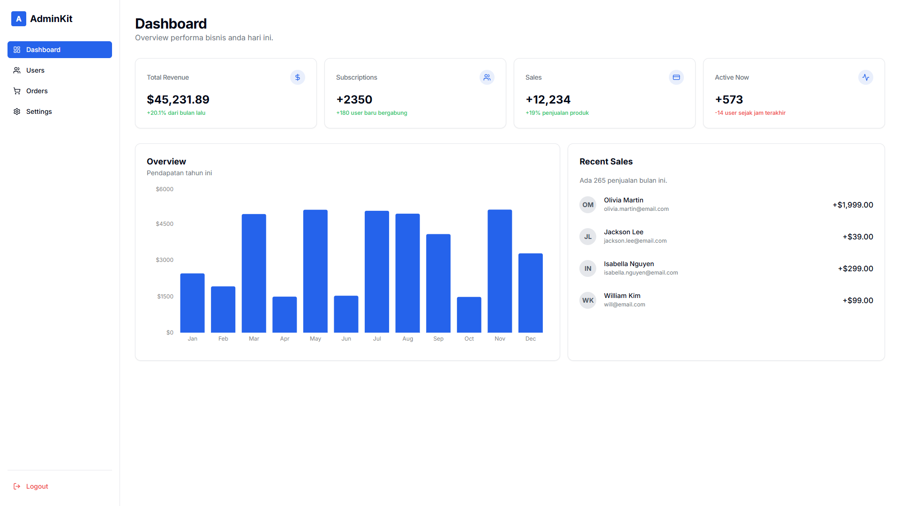

# AdminKit - Modern Next.js Dashboard Template


> *Note: Replace the image link above with your own dashboard screenshot.*

**AdminKit** is a premium dashboard template built with **Next.js 14 (App Router)**, **Tailwind CSS**, and **TypeScript**. It features a clean architecture, modular components, and a fully responsive design, making it the perfect starter kit for your next SaaS or internal tool.

## 🚀 Key Features

- **⚡️ Modern Tech Stack:** Built with Next.js 14 (App Router) & React 18.
- **🎨 Tailwind CSS:** Utility-first styling for rapid UI development.
- **📘 TypeScript:** Type-safe code for better maintainability.
- **📱 Fully Responsive:** Optimized for all devices (Mobile, Tablet, Desktop).
- **📊 Interactive Charts:** Beautiful data visualization using Recharts.
- **🔐 Authentication UI:** Professional Split-screen Login & Register pages.
- **🧩 Modular Components:** Pre-built Stats Cards, Tables, Modals, and Sidebar.

## 🛠️ Getting Started

Follow these steps to get the project running on your local machine.

### 1. Installation

Install the required dependencies:

```bash
npm install
# or
yarn install
# or
pnpm install
```
### 2. Run Development Server

Start the local server:

```bash
npm run dev
```
Open http://localhost:3000 with your browser to see the result. You can start editing the page by modifying src/app/page.tsx. The page auto-updates as you edit the file.

📂 Project Structure

A quick look at the top-level files and directories you'll see in this project:
```
src/
├── app/                  # Next.js App Router Pages
│   ├── dashboard/        # Protected Dashboard Routes (Users, Settings, etc.)
│   ├── login/            # Authentication Page
│   └── layout.tsx        # Root Layout & Font Setup
├── components/           # Reusable UI Components
│   ├── dashboard/        # Dashboard-specific widgets (Charts, Tables)
│   ├── layout/           # Sidebar & Header Navigation
│   └── ui/               # Atomic Components (Buttons, Avatars, Inputs)
├── lib/                  # Utilities (Tailwind class merger, helper functions)
└── styles/               # Global CSS
```

📖 Documentation & Resources
-  Next.js Documentation - Learn about Next.js features
-  Tailwind CSS Docs - Styling documentation.
-  Recharts - Charting library documentation.
-  Lucide React - Icon library used in this template.

📄 License

AdminKit is a premium digital product.

✅ You are Allowed to:
- Use this template for unlimited Personal projects.
- Use this template for unlimited Commercial projects (SaaS, Client work, Internal tools).
- Customize and modify the code to fit your specific needs.

❌ You are NOT Allowed to:
- Resell, redistribute, or share the source code of this template as a standalone product.
- Claim this template as your own design to sell on marketplaces (e.g., Gumroad, ThemeForest, Etsy).

Created with ❤️ by Hilman Syahid Effrianto.
